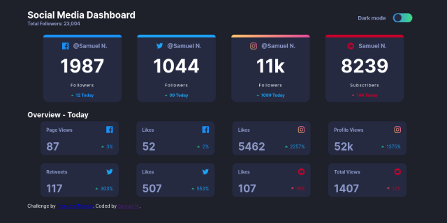

# Frontend Mentor - Social media dashboard with theme switcher solution

Esta es una solucion al reto de [Social media dashboard with theme switcher challenge on Frontend Mentor](https://www.frontendmentor.io/challenges/social-media-dashboard-with-theme-switcher-6oY8ozp_H). Frontend Mentor retos que ayudan a mejorar las habilidades de coding y construir proyectos realistas


## General

### El reto

Los usuarios deberian poder

- Ver el diseño óptimo para el sitio según el tamaño de la pantalla de su dispositivo
- Ver estados de desplazamiento para todos los elementos interactivos en la página
- Alternar el tema de color a su preferencia

### Screenshot




### Links
- Repositorio URL : [Github](https://github.com/SamuelNarciso/social-media-dashboard)
- Demo URL : [GitHub-Pages](https://samuelnarciso.github.io/social-media-dashboard/)

## Mi proceso

### Construido con

- HTML5
- CSS 
- Sass 
- Flexbox
- media queries
- javascript 


### Que aprendi?

Aprendi como modificar un checkbox con css, organizar mediante flexbox y como hacer un cambio de colores en la vista utilizando 
solamente css y javascript

Como cambiar los colores de forma facil con Javascript y CSS

```scss
$white: #1e202a ;
$dark: #ffffff ;
body{
  background: $white ;
  color:$dark ;

&.dark :{
  color:$white ;
  background: $dark ;
  }
}
```
```javascript

  document.querySelector('body').classlist.toggle('dark')

```

### Recursos utilies

- [Css Gradient](https://cssgradient.io/) - Esta pagina me ayudo para realizar el gradiente de instagram

- [Switch, dark mode with css and js ](https://youtu.be/2Nmi1sXu12U) -Este video me ayudo a construir el switch que utilice en esta practica.

## Autor

- Github - [SamuelNarciso](https://github.com/SamuelNarciso)
- Instagram - [Samuel_Narciso](https://www.instagram.com/samuel_narciso/)
- Twitter - [SamuelNarciso28](https://twitter.com/SamuelNarciso28)
- Youtube - [SamuelNarciso](https://www.youtube.com/channel/UCdlswAjW13BPfV9jo5VLJnQ)

